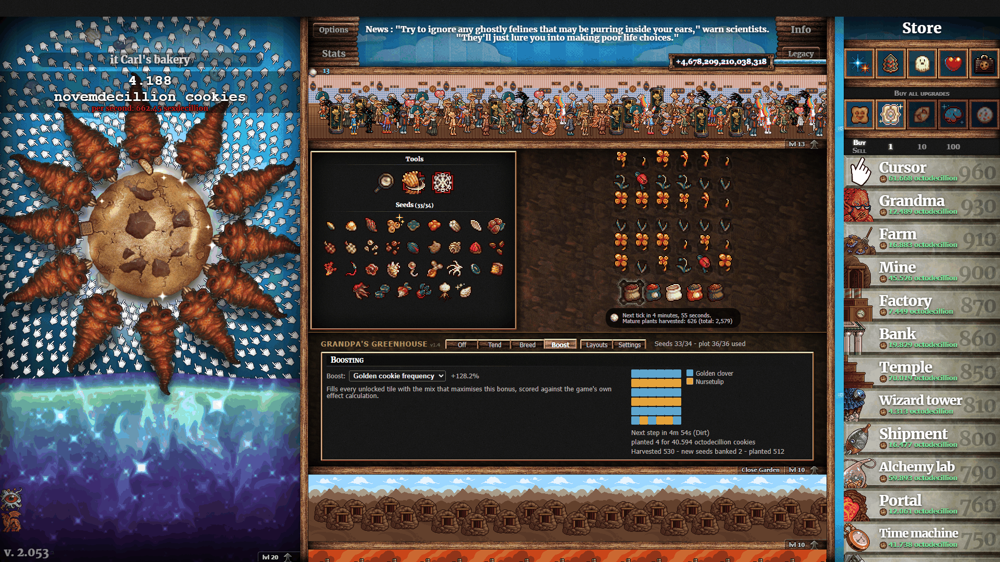
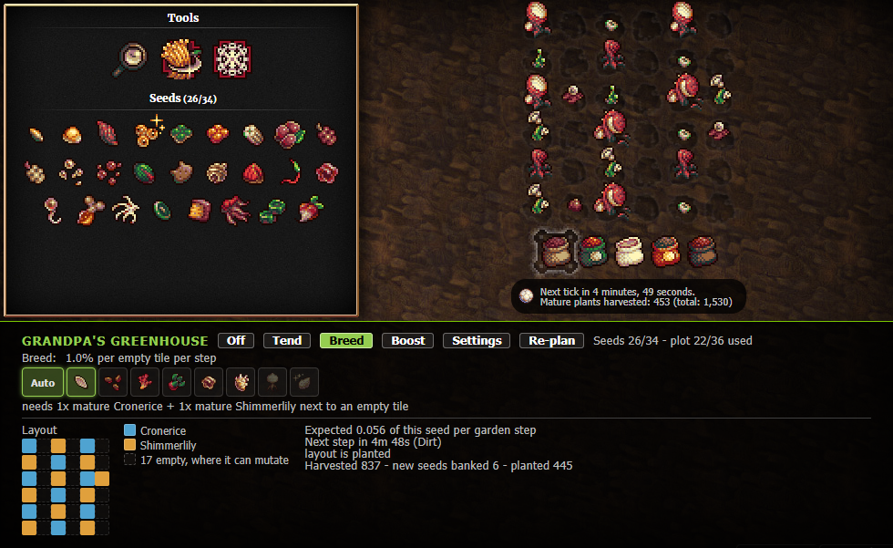

<a id="readme-top"></a>

<div align="center">
  

  <h3 align="center">Grandpa's Greenhouse</h3>

  <p align="center">
    A garden assistant for Cookie Clicker's Farm minigame that breeds the seeds you are missing.
    <br />
    <a href="https://github.com/itCarl/GrandpasGreenhouse/releases"><strong>Download the latest release</strong></a>
    <br />
    <br />
    <a href="https://github.com/itCarl/GrandpasGreenhouse/issues/new?labels=bug">Report Bug</a>
    &middot;
    <a href="https://github.com/itCarl/GrandpasGreenhouse/issues/new?labels=enhancement">Request Feature</a>
  </p>

  
  
  
</div>

<details>
  <summary>Table of Contents</summary>
  <ol>
    <li><a href="#about-the-project">About The Project</a></li>
    <li><a href="#features">Features</a></li>
    <li>
      <a href="#installation">Installation</a>
      <ul>
        <li><a href="#steam-workshop">Steam Workshop</a></li>
        <li><a href="#manual">Manual</a></li>
      </ul>
    </li>
    <li><a href="#how-it-works">How It Works</a></li>
    <li><a href="#development">Development</a></li>
    <li><a href="#license">License</a></li>
    <li><a href="#acknowledgments">Acknowledgments</a></li>
  </ol>
</details>

## About The Project

Grandpa's Greenhouse is a garden assistant. Pick a seed you are missing and it
works out which parents breed it, arranges the plot to maximise the odds, keeps
that layout planted, and harvests a new species the moment it matures so the
seed is banked.





- **No hardcoded recipes.** At startup it recovers the full breeding table,
  ceilings included, from the game's own mutation function `M.getMuts`. If the
  game retunes a recipe, the mod follows without an edit.
- **Plans layouts** by hill climbing from several seed shapes and scores them
  through the game's own functions. It beats the community's hand-drawn layouts
  in 4 of 6 cases and matches them in the other 2.
- **Maturity-aware odds.** A parent only counts while it is mature, and rival
  mutations competing for the same tile are priced in exactly.
- **Asks before uprooting.** It never removes a plant that would keep living
  without asking first.

Starting from a fresh save, it unlocks about 28.6 of 34 species unattended in
3000 garden steps, against 6.8 for tending alone.

<p align="right">(<a href="#readme-top">back to top</a>)</p>

## Features

- Four modes:
  - **Off** - nothing is touched; the panel still shows recipes and progress.
  - **Tend** - harvests anything new, clears plants about to expire, uproots
    ripe meddleweed. Your layout is left alone.
  - **Breed** - works towards one seed (yours or its own pick), lays out the
    plot and keeps it planted.
  - **Boost** - fills the plot with the layout that maximises a bonus you
    choose, scored with the game's own `computeEffs`.
- Seed picker drawn with the game's own seed-packet icons. Tiles are ordered by
  the assistant's ranking; unreachable seeds stay visible, greyed out. An
  **Auto** tile hands the choice back to the assistant.
- Ask-before-clearing: switching to Breed or Boost over a growing garden shows
  a prompt (`Clear them` / `Keep them`) instead of acting. "Keep them" is a real
  answer - the layout fills in around those plants.
- Targets are ranked by `chance x seeds it unblocks`, so a 1% seed that opens
  four others beats a 5% dead end.
- Deliberately farms meddleweed when that is the best option, since half the
  tree sits behind it.
- Layout map, expected yield per step, next-step timer and a running action log
  in the panel.
- Spending cap of 15% of your cookies per garden step. Immortal plants are
  never uprooted for a layout.
- No monkey-patching: runs off the documented `logic` hook and `M.nextStep`.

<p align="right">(<a href="#readme-top">back to top</a>)</p>

## Installation

### Steam Workshop

Search the Cookie Clicker Workshop for **Grandpa's Greenhouse** and subscribe.

### Manual

1. Download `GrandpasGreenhouse.zip` from
   [GitHub Releases](https://github.com/itCarl/GrandpasGreenhouse/releases).
2. Unzip it into
   `<Cookie Clicker>/resources/app/mods/local/GrandpasGreenhouse/`.
3. Restart the game and enable the mod under **Options -> Mods**. The panel
   appears under the garden.

<p align="right">(<a href="#readme-top">back to top</a>)</p>

## How It Works

- **Reading the tree.** `M.getMuts(neighs, neighsM)` maps a neighbourhood to a
  list of `[species, chance]`. The mod feeds it every species alone at counts
  1-8 and every pair that fits in eight tiles - about 15,000 probes, a few tens
  of milliseconds - and reads the whole table back. Each recipe is re-probed at
  rising counts to find its ceiling.
- **Rival mutations.** The game rolls every mutation a tile offers and plants
  exactly one of the winners, chosen uniformly. The mod computes the exact
  landing chance (a small Poisson-binomial) and scores layouts on what actually
  lands, not on the table value.
- **Maturity.** Most recipes key off `neighsM`, only neighbours past their
  `mature` age. For each species around a tile the number currently grown is
  treated as binomial, every state is enumerated and priced by `getMuts`, so
  slow-growing bottleneck parents get more copies.
- **Expiry margin** is one of the plant's own growth steps rather than a fixed
  age, so every species keeps the window it was planted for.
- **Boost** candidates are planted on a scratch plot and scored with the real
  `computeEffs`; the real plot and effect caches are restored byte-identically.
- **Safety.** The tick body is wrapped so errors show in the panel instead of
  breaking `Game.Logic()`, and the source is ASCII-only because the game
  injects mod scripts without a declared charset.

`Game.mods['grandpas greenhouse']` exposes a small read-only API (`getRecipes`,
`getPlan`, `getStats`, `setMode`, `setTarget`, `replan`, ...) that the test
harness drives. See [`mod/README.md`](mod/README.md) for the full write-up and
benchmark tables.

<p align="right">(<a href="#readme-top">back to top</a>)</p>

## Development

```
mod/        what the game loads, and all that ships to the Workshop
moddev/     the test harness - never loaded, never shipped
```

The game publishes a mod by zipping its folder whole, so anything beside
`main.js` would reach every subscriber. The harness and the repository's `.git`
live outside `mod/` for that reason.

```
cd moddev
node test.js
```

The tests do not run against a model of the game: `moddev/garden.js` loads
Cookie Clicker's own minigame source into a sandbox with a seeded PRNG, a
virtual clock and DOM stubs. They therefore need the game's sources from a
local Steam install of Cookie Clicker.

| Script | What it answers |
|---|---|
| `moddev/test.js` | behavioural tests |
| `moddev/bench.js` | seeds discovered, unattended |
| `moddev/layouts.js` | layouts scored against the community charts |
| `moddev/odds.js` | how much of its life each plant spends mature |

<p align="right">(<a href="#readme-top">back to top</a>)</p>

## License

Distributed under the MIT License. See [`LICENSE`](LICENSE) for details.

<p align="right">(<a href="#readme-top">back to top</a>)</p>

## Acknowledgments

- [Orteil's Cookie Clicker](https://orteil.dashnet.org/cookieclicker/) - the game this mod reads everything from

<p align="right">(<a href="#readme-top">back to top</a>)</p>
